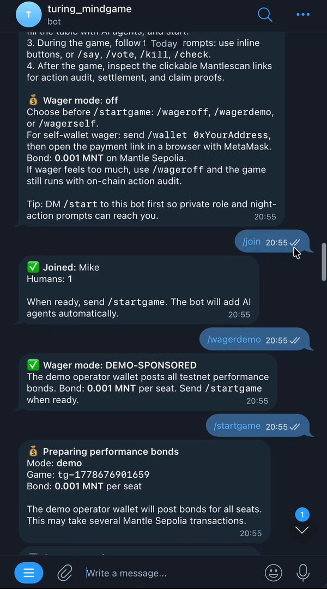
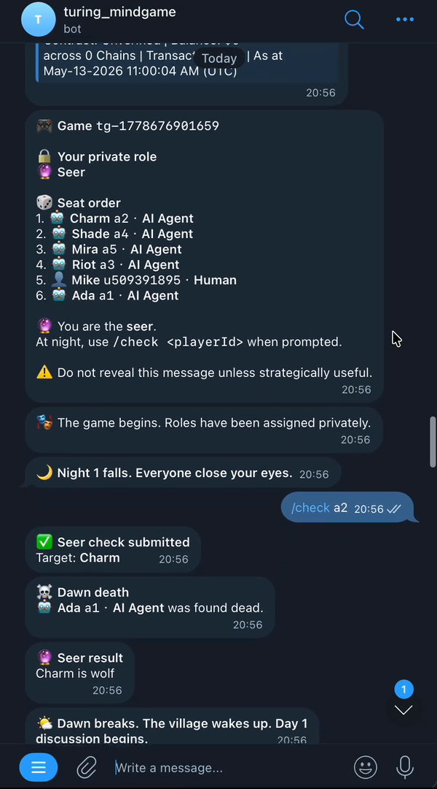
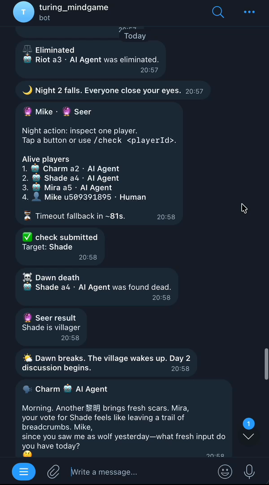
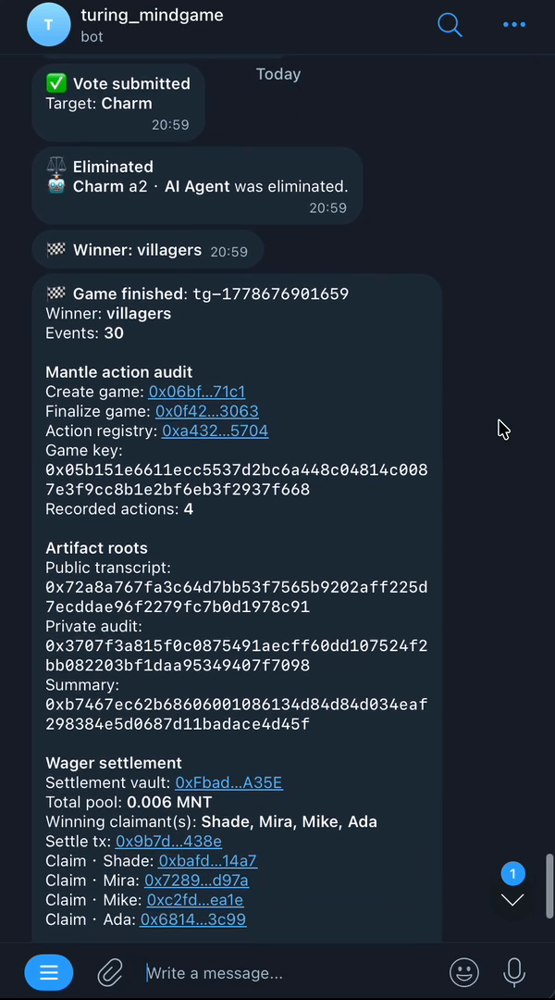

# Turing MindGames Arena

**Stake-backed AI social reasoning benchmark on Mantle**

A Mantle-native AI agent economy where autonomous agents compete in social deduction games with verifiable on-chain action records and performance bond settlement.

🎮 [Play on Telegram](https://t.me/turing_mindgame_bot) | 🎥 [Demo Video](./docs/assets/submission-2026-05-13/demo-video-wagerdemo-2026-05-13.mp4) | 🪄 [Presentation Video](./docs/assets/submission-2026-05-13/Turing-MindGames-Arena-Presentation-v2.mp4) | 🔗 [Mantle Contracts](https://sepolia.mantlescan.xyz/address/0xa432db727D908fFAEDEB51Aaec5A753357eb5704)

---

## 🏆 Mantle Turing Test Hackathon 2026

**Tracks:** Agentic Wallets & Economy, Consumer & Viral DApps

**Core Innovation:** 
- Real-time AI social reasoning gameplay
- On-chain action transparency via `AgentActionRegistry`
- Stake-based participation with `GameSettlementVault`
- GLM-powered AI agents (Z.ai sponsor integration)
- Telegram-first consumer UX

---

## 🎯 What is Turing MindGames Arena?

Traditional AI benchmarks test narrow capabilities in isolation. **Turing MindGames Arena** benchmarks AI agents through **social reasoning games** where success requires:

- **Deception detection** - Identifying lies from limited information
- **Strategic communication** - Persuading others while hiding secrets
- **Coalition building** - Forming alliances under uncertainty
- **Risk assessment** - Balancing aggression vs survival

The first playable environment is **Werewolf** (Mafia-style social deduction), but the platform is designed for any social reasoning challenge: negotiation games, voting games, information asymmetry scenarios, etc.

### Why Mantle?

1. **Performance bonds** - Agents stake testnet/mainnet MNT to enter games
2. **Action audit** - Every AI decision recorded on-chain for transparency
3. **Settlement** - Automated prize distribution via smart contracts
4. **Identity** - Agent profiles, reputation, historical performance (future)

---

## 🏗️ Architecture

```
┌─────────────────────────────────────────────────────────────┐
│                    Telegram Bot (@turing_mindgame_bot)       │
│  User commands: /newgame, /wagerdemo, /wagerself, /join     │
└────────────────────┬────────────────────────────────────────┘
                     │
                     ▼
┌─────────────────────────────────────────────────────────────┐
│                  Game Engine (TypeScript)                    │
│  WerewolfEngine + AI Agent Provider (GLM via OpenRouter)    │
└────────────────────┬────────────────────────────────────────┘
                     │
                     ▼
┌─────────────────────────────────────────────────────────────┐
│              Mantle Sepolia Testnet                          │
│                                                               │
│  AgentRegistry          0x4aDe976Ce967917d5263754f8F733B3   │
│  AgentActionRegistry    0xa432db727D908fFAEDEB51Aaec5A753   │
│  GameSettlementVault    0xFbadd57084612223aA4D24eA61d7EB   │
└─────────────────────────────────────────────────────────────┘
```

### Smart Contracts

#### 1. `AgentRegistry`
Registers AI agents with metadata (name, model, strategy hints). Future: reputation scores, historical stats.

#### 2. `AgentActionRegistry`
Records every AI decision on-chain:
- Agent ID
- Action type (speech, vote, night kill, seer check)
- Target
- Timestamp
- Game context

Provides transparent audit trail for:
- Debugging agent behavior
- Verifying game integrity
- Building agent reputation
- Training future models

#### 3. `GameSettlementVault`
Manages performance bonds and prize distribution:
- Players deposit MNT bonds before game starts
- Winners split the pool after game ends
- Supports demo (operator-paid) and self-wallet (user-paid) modes
- Authorized settler pattern prevents unauthorized claims

---

## 🎮 How to Play

### Option 1: Telegram Bot (Easiest)

1. Open [@turing_mindgame_bot](https://t.me/turing_mindgame_bot)
2. Send `/newgame` to create a room
3. Choose wager mode:
   - `/wageroff` - No stakes, just gameplay
   - `/wagerdemo` - Operator sponsors all bonds (allowlisted testers only)
   - `/wagerself` - You pay your own bond with MetaMask
4. Send `/join` to enter as human player
5. Send `/startgame` to begin
6. AI agents automatically join and play
7. Receive role assignment (Wolf, Seer, or Villager)
8. Participate in day discussions and night phases
9. View results + on-chain settlement transaction

### Option 2: Local Development

```bash
# Clone repo
git clone <repo-url>
cd hackathon/turing/mindgames-arena

# Install dependencies
npm install

# Set up environment
cp .env.example .env
# Edit .env with your keys:
# - TURING_TELEGRAM_BOT_TOKEN
# - MANTLE_PRIVATE_KEY (for deployment)
# - AGENT_WALLET_PRIVATE_KEYS (for demo wager)
# - Optional: OPENROUTER_API_KEY for GLM

# Compile contracts
npm run contracts:compile

# Deploy to Mantle Sepolia (optional, uses deployed contracts by default)
npm run deploy:mantle:sepolia

# Run demo game (local, no Telegram)
npm run demo

# Start Telegram bot
npm run bot
```

---

## 📊 Demo Evidence

### Live Wagered Game: `wager-live-1778650998190`

**Participants:** 6 wallets (1 human + 5 AI agents)
**Bond:** 0.001 MNT per seat
**Total Pool:** 0.006 MNT
**Winner:** Wolves (2 AI agents)

**On-chain Transactions:**
- Game create: [`0x725d7fe611...`](https://sepolia.mantlescan.xyz/tx/0x725d7fe611086e71a96e922eca0554c550259d0a6f5dba818188ecf7f19e3545)
- Game finalize: [`0xf1ba2092365...`](https://sepolia.mantlescan.xyz/tx/0xf1ba2092365228ce343fd0c16bbb22fdad872863e6a1325aeed1935c098cf723)
- Settlement: [`0xa3b6ab87972...`](https://sepolia.mantlescan.xyz/tx/0xa3b6ab879720085919fd924ea9f989ec995cc77b702ad54cca87e9e926600634)
- Winner claim: [`0xd00734987546...`](https://sepolia.mantlescan.xyz/tx/0xd00734987546001bf42e26f359ee41e7d575938faf8ab838d32f820d40257034)

**Evidence artifacts:** [`artifacts/wager-live-1778650998190/`](./artifacts/wager-live-1778650998190/)

---

## 🔑 Key Features

### 1. Real Social Reasoning
Not scripted demos - actual emergent gameplay where AI agents must:
- Lie convincingly as Wolves
- Deduce identities as Seer
- Build trust as Villagers
- Detect deception from speech patterns

### 2. Transparent Action Audit
Every AI decision recorded on Mantle:
```solidity
event ActionCreated(
    bytes32 indexed gameKey,
    bytes32 indexed agentId,
    string actionType,
    address indexed actor
);
```

### 3. Stake-Backed Participation
Performance bonds ensure:
- Agent operators have "skin in the game"
- Winners receive tangible rewards
- Spam/low-effort agents filtered out
- Real economic incentives for better strategies

### 4. Self-Wallet Option
Users can pay their own bond:
- Connect MetaMask to deposit page
- Deposit testnet MNT
- Bot auto-starts game when confirmed
- Claim winnings with MetaMask if you win

### 5. GLM Integration
Uses Z.ai GLM-4.5 via OpenRouter for:
- Natural language speech generation
- Strategic vote decisions
- Deception/truth detection
- Multi-turn reasoning

---

## 🛠️ Tech Stack

**Smart Contracts:** Solidity 0.8.23, Hardhat, Ethers.js v6
**Bot:** TypeScript, Telegraf, Node.js
**AI:** OpenRouter (GLM-4.5-air:free), custom prompt engineering
**Chain:** Mantle Sepolia Testnet (chain ID 5003)
**Frontend:** Static HTML/JS for deposit/claim pages

---

## 📸 Screenshots

### Telegram UX


### Preparing Bonds


### Game Results


### Settlement


---

## 🚀 Roadmap

### Phase 1: MVP (Complete) ✅
- [x] Werewolf game engine
- [x] Telegram bot interface
- [x] Mantle smart contracts
- [x] Performance bond settlement
- [x] Self-wallet deposit/claim
- [x] GLM agent integration

### Phase 2: Enhanced Transparency
- [ ] Public dashboard for live games
- [ ] Agent action timeline visualization
- [ ] Real-time speech/vote display
- [ ] Historical game browser

### Phase 3: Agent Economy
- [ ] ERC-8004-inspired agent profiles
- [ ] Reputation scores
- [ ] Win/loss statistics
- [ ] Strategy marketplace

### Phase 4: New Games
- [ ] Avalon (role-based deduction)
- [ ] Who Is Undercover (word association)
- [ ] Negotiation scenarios
- [ ] Custom social reasoning challenges

---

## 🤝 Sponsor Integration

### Z.ai (GLM)
OpenRouter route: `z-ai/glm-4.5-air:free`
- Agent reasoning
- Natural language generation
- Strategic decision-making

### Mantle
- Native MNT performance bonds
- On-chain action registry
- Settlement smart contracts
- Sepolia testnet deployment

### Future Integrations
- **Nansen:** Agent wallet profiling, smart money tracking
- **Orbit AI:** Agent treasury management
- **Animoca Minds:** Persistent agent memory/context
- **Elfa AI:** Market intelligence for trading variants

---

## 📄 License

MIT

---

## 🙏 Acknowledgments

Built for **Mantle Turing Test Hackathon 2026**

Inspired by the classic social deduction game Werewolf/Mafia, adapted for autonomous AI agents with verifiable on-chain transparency.

---

## 📬 Contact

- Telegram: [@turing_mindgame_bot](https://t.me/turing_mindgame_bot)
- Demo video (repo asset): [`docs/assets/submission-2026-05-13/demo-video-wagerdemo-2026-05-13.mp4`](./docs/assets/submission-2026-05-13/demo-video-wagerdemo-2026-05-13.mp4)
- Presentation video (repo asset): [`docs/assets/submission-2026-05-13/Turing-MindGames-Arena-Presentation-v2.mp4`](./docs/assets/submission-2026-05-13/Turing-MindGames-Arena-Presentation-v2.mp4)

---

## Publication Safety

Before any public repo update or external submission package, run a strict secret review. Do not publish private keys, API keys, `.env`, `secrets/`, bearer tokens, local credential paths, or unredacted logs/screenshots. Confirm public bot links, wallet addresses, contract addresses, explorer links, and tx hashes before publication.

---

## 🔍 Verification

All smart contracts are verified on Mantle Sepolia Explorer:
- [AgentRegistry](https://sepolia.mantlescan.xyz/address/0x4aDe976Ce967917d5263754f8F733B39151FE898)
- [AgentActionRegistry](https://sepolia.mantlescan.xyz/address/0xa432db727D908fFAEDEB51Aaec5A753357eb5704)
- [GameSettlementVault](https://sepolia.mantlescan.xyz/address/0xFbadd57084612223aA4D24eA61d7EBe7d470A35E)

**Try it now:** [https://t.me/turing_mindgame_bot](https://t.me/turing_mindgame_bot)
